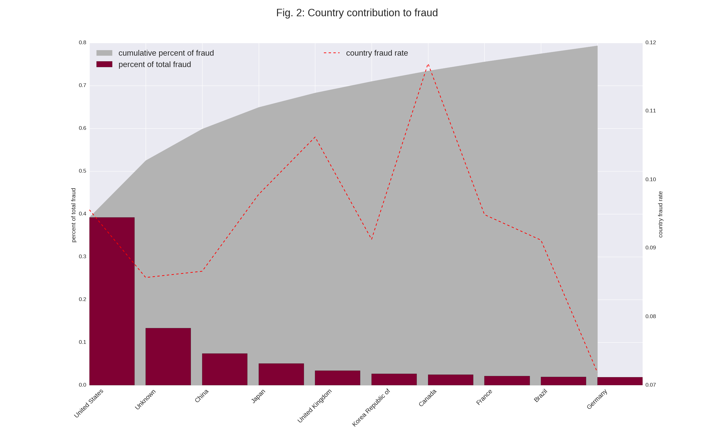
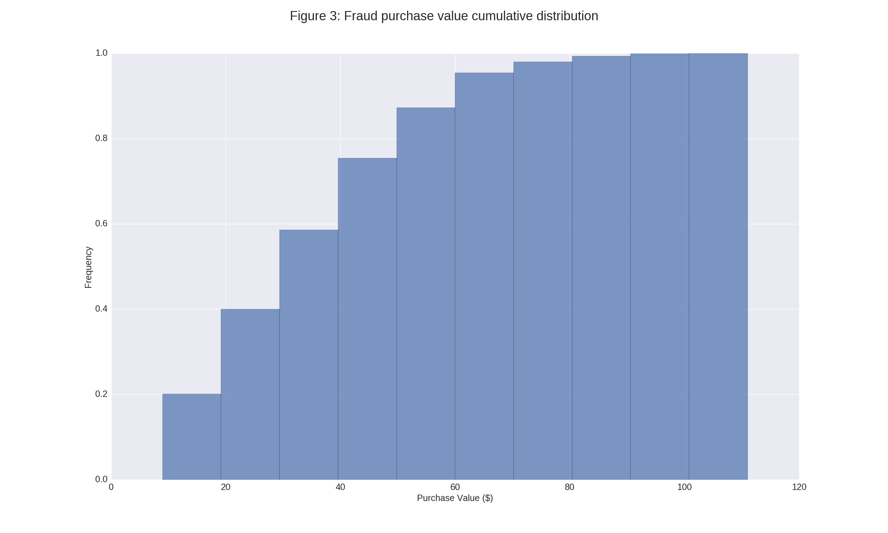
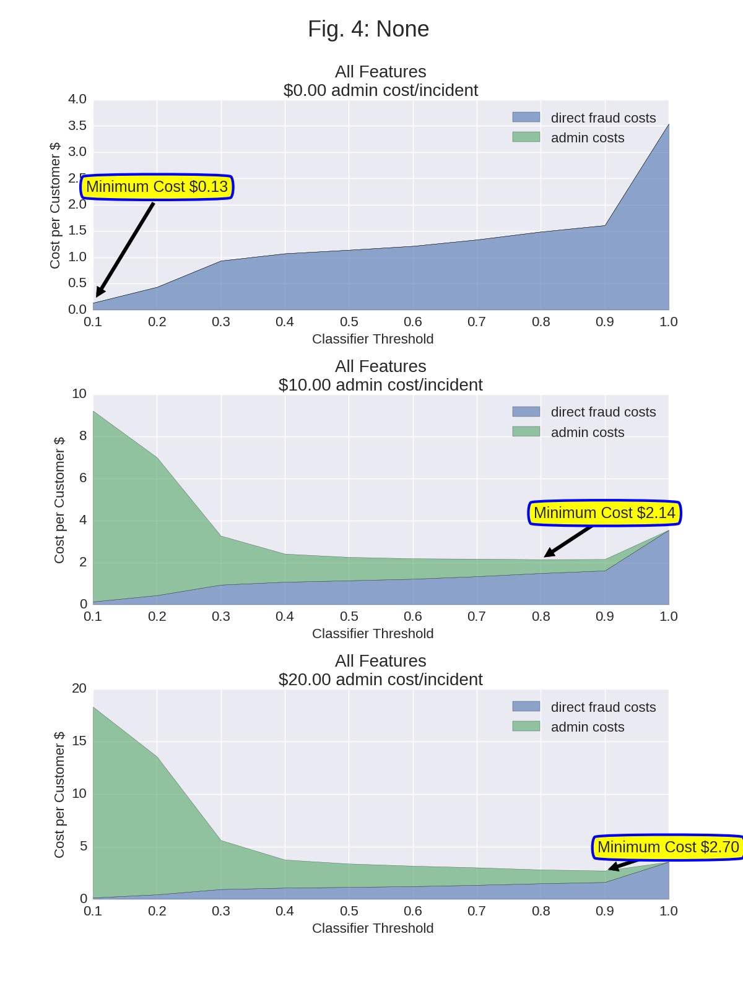

#Ecommerce Fraud Detection Study

##Introduction

Starting with a dataset of about 151,000 unique customer transactions, 14,000 transactions are classified as fraudulent which equates to an overall 9.4% fraud rate.  There was an additional dataset providing a mapping from the ip address of each transaction to the customer country.  By joining these two datasets, I matched about 130,000 customers to their origin country.  About 22,000 remain unknown.  From an external source, [http://blog.plsoucy.com/2012/04/iso-3166-country-code-list-csv-sql/](http://blog.plsoucy.com/2012/04/iso-3166-country-code-list-csv-sql/ ), I was able to group countries into continents for a more aggregated analysis.

Next, I looked at fraud rates for segments of the customer population.  One variable of interest was the age of the customer account.  It would make sense that newer accounts without much history would tend to have a higher proportion of the fraudulent activities.  I calculated the difference between the sign up date and the purchase data, and binned the results into quartiles.  I also binned customer ages into quintiles and purchase value into quartiles.  

As a further check, I verified that each of the 151,000 transactions belonged to a unique user_id.  I also checked the uniqueness of the device_id and found that 131,000 devices were each used in one transaction, but about 20,000 transactions were associated with customers using common devices.  It is possible that unique customers living in the same household might use a common device, but I wanted to investigate further.  It turns out that the remaining 20,500 transactions were associated with devices used in 2 to 20 transactions.  

Above is Fig. 1, a barplot, which plots the fraud rate against various categories.  Figure 1(a) shows that the highest fraud rates were associated with direct targeting of the website.  Males tend to have a higher fraud rate than females 1(b) .  New accounts less than 25 days old have over a 20% fraud rate compared to older  accounts having less than a 16% rate.  There does not seem to be any pattern of fraud over customer age and purchase value.  For location (1(c)), fraud was more prevalent from Oceana, South America, and Africa.  North America was slightly above the average, wheras Asia and  Europe were below the average rate.  The most dramatic plot is figure 1(g) showing fraud rate as a function of number of users per device.  When a device is shared by 2 or 3 users, the fraud rate is 20%.  This jumps to 60% at 4 users and 80% at 5 users ending at about 90% for numbers above that.       

  
  
Looking at Fig. 2, one can see that as a percentage of the total fraudulent activity, the United States makes up the highest percent of fraud, followed by a category of 'unknown' countries, China, Japan, UK, Korea, etc.  Together, 10 countries make up 80% of all fraud. 
 
##The model and fraud detection strategy

 For the classifier model, I used 6 predictive variables, including referring source, sex, continent, account_age, customer age, and number of users associated with a single device.  In order to guard against over-fitting I chose not to use each individual country in the model.  Next, I binarized each feature into category variables.  I ran various sklearn classifiers with train / test split of 70%, and found that random forest classifier was reasonally good and fast (using class_weights='balanced' to account for imbalanced classes).  The F1-score which is a composite of recall and precision was 0.62 against the test data.  Without the duplicate device features, the f1-score drops to 0.34 and then to 0.17 without device and account age.   
 
 Next, I made some assumptions about the financial impacts of various strategies.  For example, I assumed that the cost of an undetected fraudulent activity (false negative) would have a cost of the entire purchase value of that incident.  For cases in which the model predicted fraud, we would incur a $5 admin fee to inquire about the transaction.  By spending this amount for investigating suspected incidents, we would save the fraud loss if the investigation proved to be true.    
 
The following confusion matrix shows what the costs would be under various prediction scenarios. 
   
                     Prediction                               
|       |          |False  | True  |
|--------------|--------|------------|-------|
|Actual | False | True Negative (0)      | False Positive (-5 admin)|
|  | True | False Negative (-Purchase Value)| True Positive (-5 admin)|

The model predicts for each observation, a probability that the transaction is fraudulent.  By using different threshold probabilities for different strategies, we can estimate  the average fraud costs of each strategy.  As seen in Figure 3 below, these costs vary with the threshold chosen.  A threshold of 0 would mean that all transactions are flagged, while a threshold of 1 would mean that no transactions are checked.  For each prediction, we calculate the cost based on the actual class vs what we predicted, and then average the results across all observations to estimate the average fraud cost per transaction.  There are three plots for Figure 3.  The top one includes all 6 features which has an f1-score of .62 at a threshold level of 0.50.  The resulting fraud burdern is lower because we can capture a lot of the fraud with high recall and precision while at the same time minimizing false positives.  
   
   

 

Based on the structure of admin costs, there may be an incentive to check more transactions if the administrative costs are fixed (i.e  no variable cost) vs. high variable costs.  At an admin cost of $0/transaction, we would use a threshold of zero and reduce the direct fraud cost to $.13.  At a higher  administrative cost of $10, the cost becomes $2.14 at an optimal threshold of 0.8.

 

The random forest classifier we used has the ability to determine the most important features relevant to the classification. The number of customers using the same device was an important indicator of fraud followed by account age.  One caveat about duplicate devices, is that we may not be able to detect multiple people using a device until it actually happens.  The analysis was a snap shot in time with accumulated data about all the customers.

Fraud detection requires balancing the expected costs of fraud with the customer relationship.  If an inquiry is made, how would the customer perceive the experience?  Would the customer be required to contact its bank to verify charges?  On the other hand, if no fraud prevention is used, what is the potential exposure?  Since the transaction sizes tend to be under $40, the exposure is approximately $3.50 per transaction.  However, if transaction sizes increase and we do not actively monitor the situation, our business insurance rates would also rise.  
      
 For now, the biggest driver for fraud may be new accounts in high growth countries.  A follow-up step would be to monitor the fraud rates for this segment as these customer purchases become a larger percentage of revenues.     
 
 